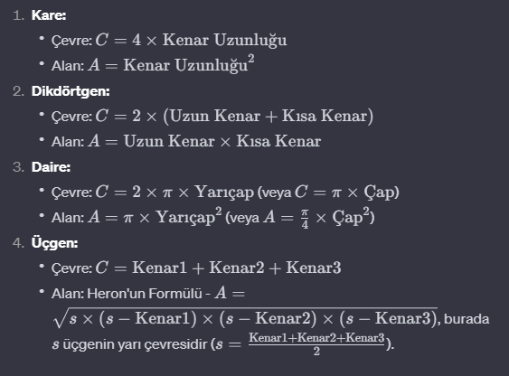

### * Write a Java program that calculates the area and perimeter of various geometric shapes (Square, Rectangle, Circle, and Triangle) by implementing an interface called "Operations".
### * The program should allow the user to select the method by which they want to perform the calculation.
### * The provided solution should include the use of interface operations with the `AreaCalculate()` and `AreaCalculate()` methods to calculate the area and perimeter of various shapes.
### * The Square, Rectangle, Circle, and Triangle classes implement the "Operations" interface and provide the relevant implementations for calculating the area and perimeter.
### * The Runner class contains a main method (`main()`) that allows the user to select the desired shape and perform area and perimeter calculations.

